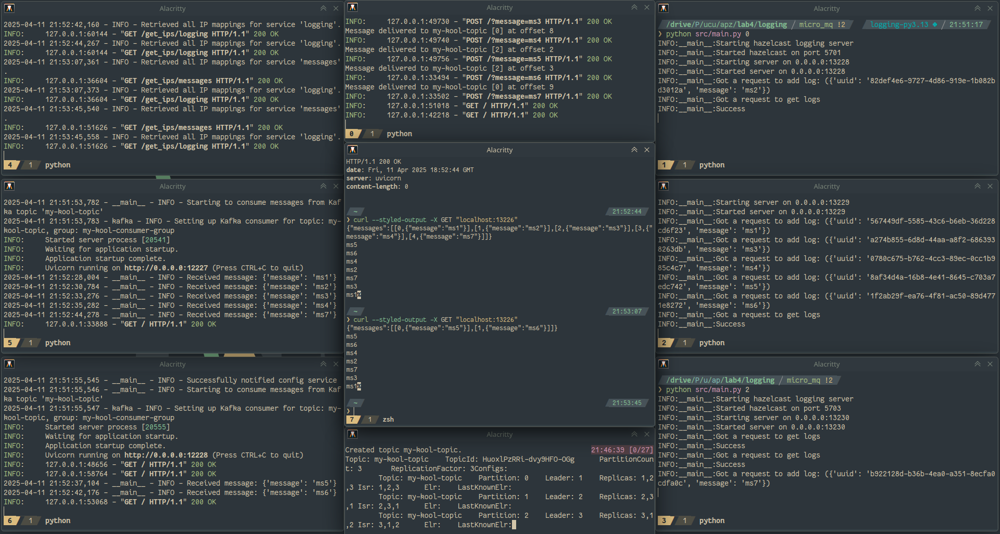
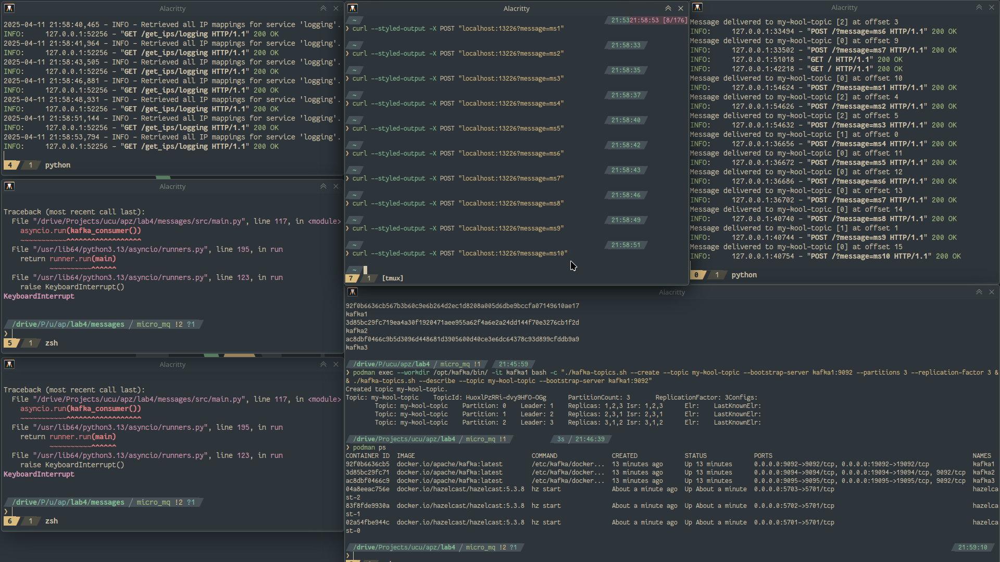
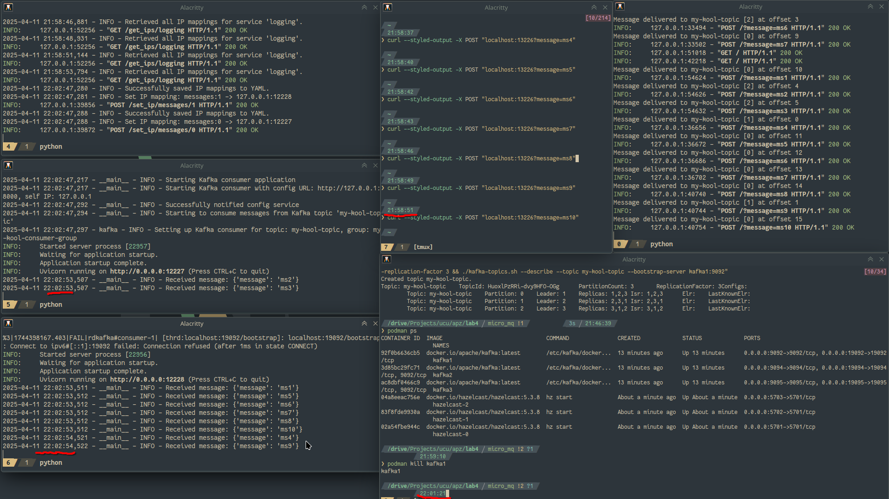

I did the task with Kafka, btw

The repo: https://github.com/rhusiev-student/s6_apz_lab4

Everything is working, when no failures:

And when there is a failure; 10 sent, with messages stopped:

I start the messages, and they receive:

