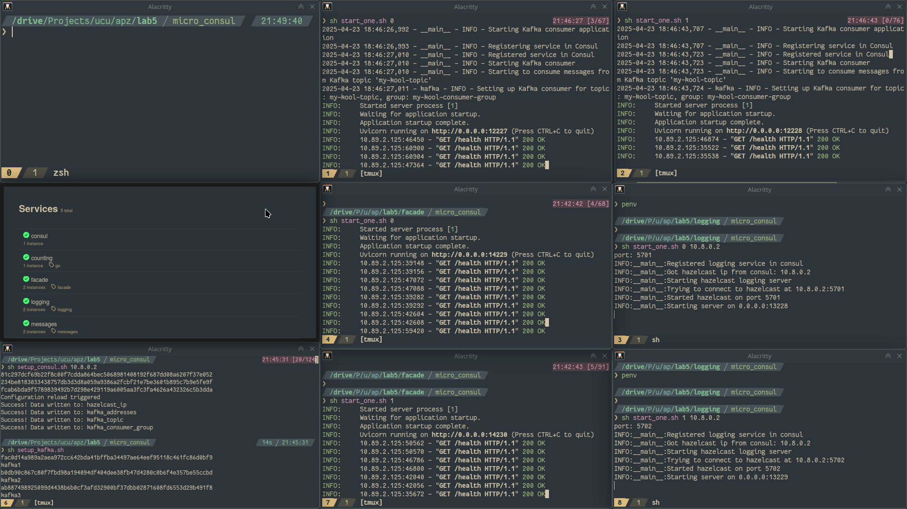
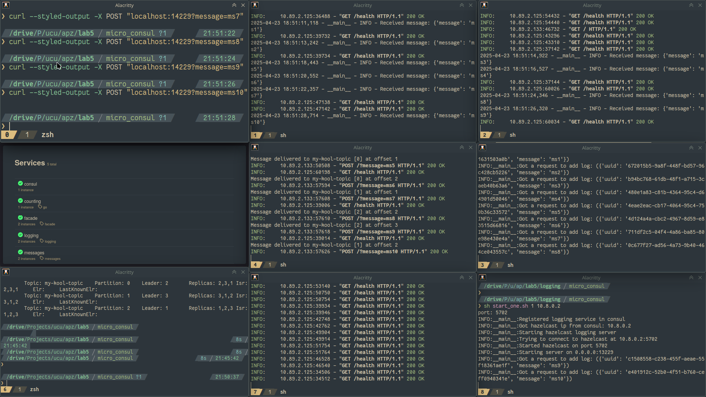
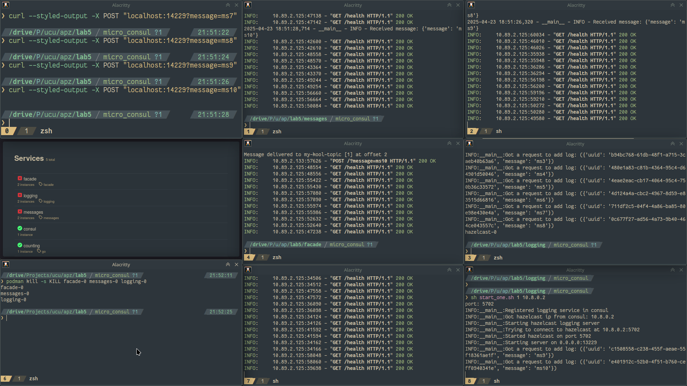
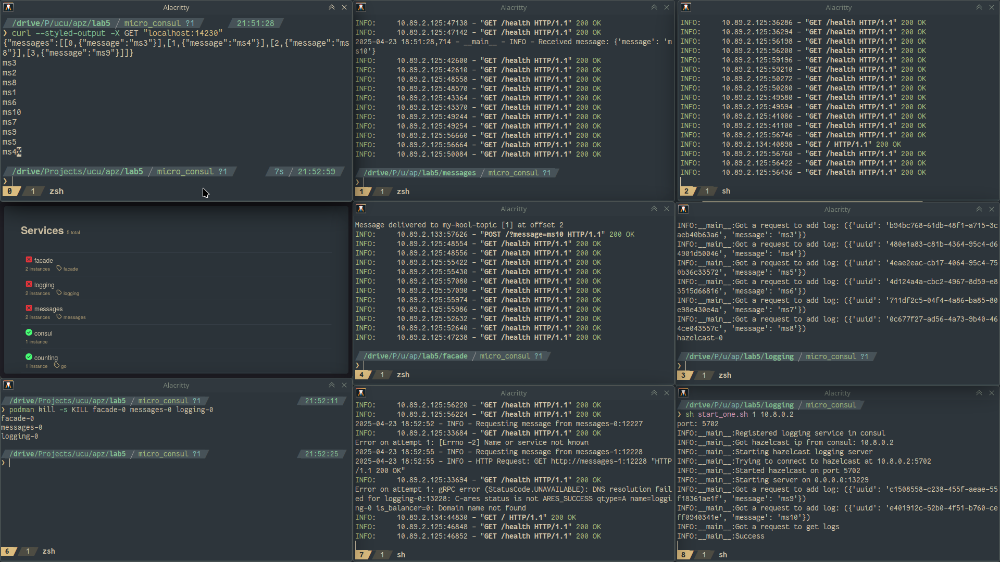
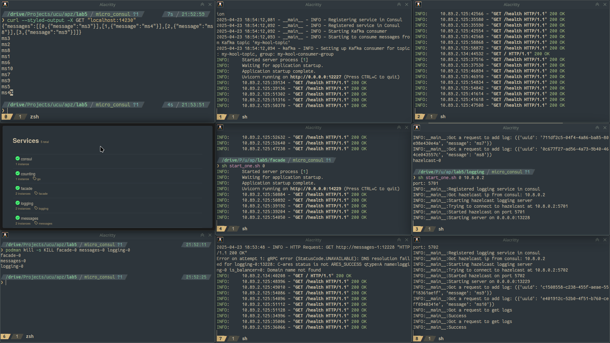
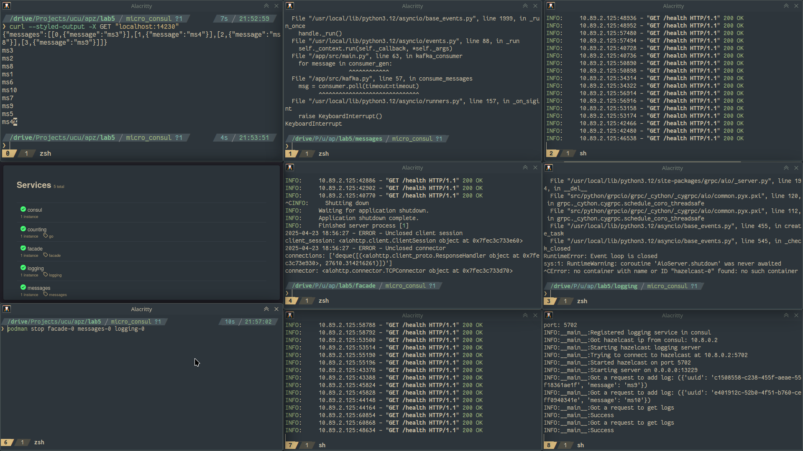

The repo: https://github.com/rhusiev-student/s6_apz_lab5

Here is how the setup looks like:

Now there are scripts to launch each service.

Here are some sample requests:

If some services fail (even with sigkill, with no chance to gracefully shutdown):

(You can even see failed checkmarks on the dashboard, with healthchecks added.)

And requests are going to the respecting service:

And the services can be restarted - everything returns to normal:

If some services fail gracefully, just fewer instances exist (no need for red checkmarks, the service just eliminated itself):

